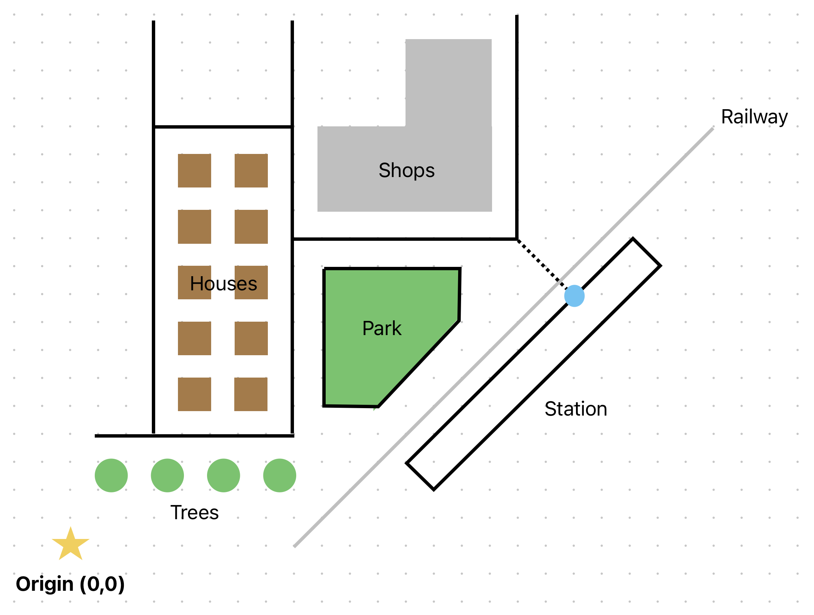

# Understanding PostGIS’s capabilities using GeoPandas

Last updated: Sep 28th 2026

  
   
  <em>Example schematic data for PostGIS queries</em>

PostGIS generalizes a PostgreSQL database to include spatial data, adding an awareness of datatypes and the necessary functions to deal with data where a spatial component is integral to its meaning. Here, we use PostGIS and GeoPandas to show common functions and combinations using a simple set of points, lines, polygons and other datatypes to illustrate key concepts. This is complimentary to many existing tutorials that go straight to real data.

## DRAFT

This project is is a draft state, not yet complete.

## Requirements

PostGIS

- Postgres SQL app
- PgAdmin4 app

GeoPandas

- Machine that can run Conda virtualenv and Python, e.g., Visual Studio code with Python extension

## Setup

PostGIS

- Install Postgres and PgAdmin4
- Create database
- [Needs `.sql` to populate the table]

GeoPandas

- Create virtualenv, e.g., `.conda` in current directory in VSCode
- `conda install -c conda-forge geopandas`
- `conda install pip`
- `pip install SQLAlchemy`
- `pip install psycopg2-binary`

## Run

PostGIS

[Need PostGIS script]

GeoPandas

- Run `shapes_from_town.py`

## Improvements

- Show more queries and `ST_` functions
- Animate the results
- Enable as a webapp
